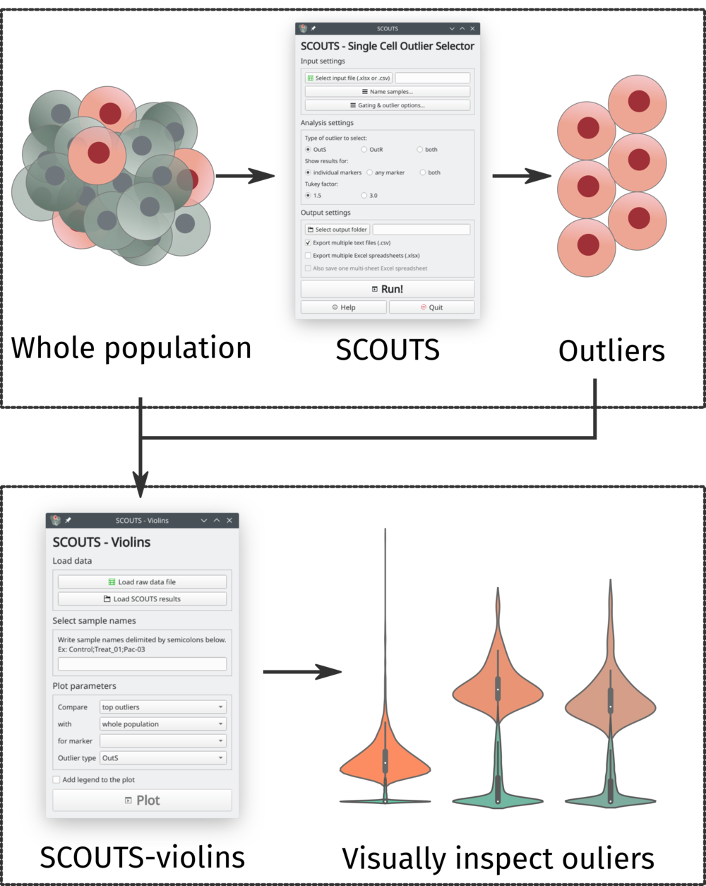

# SCOUTS - Single Cell Outlier Selector

**SCOUTS** is a tool that quickly finds **outliers in your single-cell data**, generating information about your cell population organized by markers. It is designed to analyse **mass cytometry (CyToF)** and **single-cell RNA sequencing** data (scRNASeq).

## Why SCOUTS?
Many single-cell analytical pipelines require some level of programming knowledge in order to be used. While some great tools for languages like R, Python and Julia have been developed, the entry-level barrier of programming is still intimidating for many scientists starting on the field of singe-cell analysis. With this in mind, we developed SCOUTS to simplify this process. Through a desktop application, the user is able to choose the parameters for the outlier selection, and leave the hard work of programmatically subsetting the data to SCOUTS.

As a showcase of how to interpret and explore the data generated by SCOUTS, we also developed **SCOUTS-violins**, a secondary desktop application which displays the outlier populations identified by SCOUTS as violin plots.

## Getting Started
### Installation
SCOUTS is available as a:

* Python package from PyPI - install with `pip`
* Conda package - install with `conda`
* GitHub repository - download/clone the repository
* binary release (experimental)

For any installation option (other than the binary release), SCOUTS requires **Python >= 3.6**.

Full installation instructions [are found here](https://scouts.readthedocs.io/en/master/install.html).

### Basic usage
The `scouts` package include two user interfaces:
* **SCOUTS**: used to select outliers in a population of single-cells.
* **SCOUTS-violins** (optional): used to visually inspect outliers selected by SCOUTS.

#### Using SCOUTS
[Here's a quick rundown of SCOUTS](https://scouts.readthedocs.io/en/master/start.html#using-scouts).

#### Using SCOUTS-violins
[Here's a quick rundown of SCOUTS-violins](https://scouts.readthedocs.io/en/master/start.html#using-scouts-violins).

## Documentation
[Read the full documentation here](https://scouts.readthedocs.io/en/master/).

## FAQ
[Frequently asked questions can be found here](https://scouts.readthedocs.io/en/master/faq.html).

## Citations
If you use SCOUTS, please [cite us](http://www.ufrgs.br/labsinal/).

## Authors
**Juliano Faccioni** - Programming and GUI development
* [GitHub](https://github.com/jfaccioni)
* [LinkedIn](https://www.linkedin.com/in/juliano-faccioni-9b2133167)

**Giovana Onzi** - Concept and testing
* [LinkedIn](https://www.linkedin.com/in/giovana-onzi-ba222895/)

## License
This project is licensed under the [MIT License](LICENSE.md).

## Acknowledgements
**Scientific counselling**
* Prof. Dr. Guido Lenz

**Funding**
* CAPES/CNPq
* NIH
