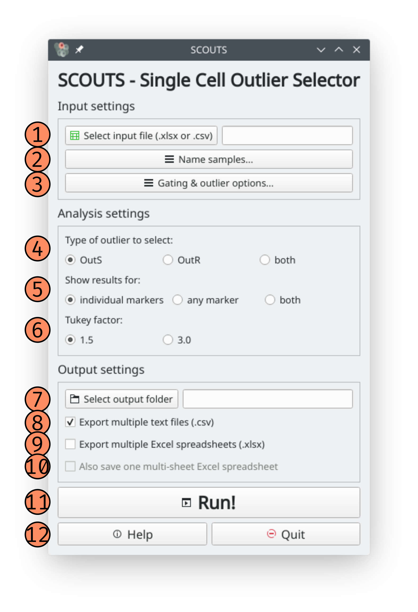
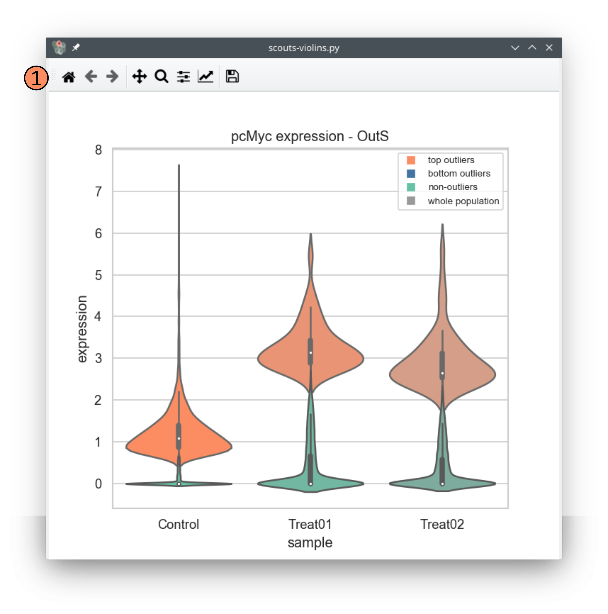

How SCOUTS-violins works
========================

Page elements
-------------
This section explains what every button and option of the SCOUTS-violins interface does.

Main window
***********
These are the elements of the main window:

**1) Input file**: this button opens up a dialog to select your input file. Valid input file formats are .xlsx and .csv.

**2) input file text**: this field shows your input file path. It updates after clicking on the input file button and selecting a file. You can also type the path directly here.

**3) Output folder**: this button opens up a dialog to select your output folder. We recommend using an empty folder to avoid confusion.

**4) Output folder text**: this field shows your output folder path. It updates after clicking on the output folder button and selecting a folder. You can also type the path directly here.

**5) Select sample names**: this opens the sample selection window (see below).

**6) Gate samples**: this opens the gate selection window (see below).

**7) Consider outliers using cutoff from**: here you can select which cutoff value SCOUTS uses to consider whether a given sample is an outlier or not.
  - **by sample**: by default, SCOUTS will consider the sample population when calculating cutoff values. This means that each sample population (control, treatment 1, treatment 2, ...) will have a specific cutoff value for each marker.
  - **by control**: using this option, SCOUTS applies the cutoff value from the control sample to all samples. This means that cells of any sample are treated as outliers for a given marker as long as they present a *higher expression than the control* - and not the sample population itself.
  - **both**: this option combines both previously described analyses. Results are saved into different files, with the filename representing the analysis performed.

**8) Consider outliers for**: here you can select how SCOUTS determines if a cell is an outlier or not.
    - **single marker**: by default, SCOUTS will locate outliers for each and every marker. If a given cell is an outlier for 2+ markers, it appears in the output table for each one of these markers. SCOUTS generates one output file for each marker/sample combination.
    - **any marker**: this option considers that cells belong to the outlier population as long as they are above the cutoff value for *at least one marker*. In contrast to the previous analysis, the output generated in this analysis is a single file containing all cells that are outliers for a single marker.
    - **both**: this option combines both previously described analyses. Results are saved into different files, with the filename representing the analysis performed.

**9) Tukey factor**: by default, SCOUTS uses a Tukey factor of 1.5 when calculating the cutoffs for outliers. You can perform a more robust outlier selection by specifying a Tukey factor of 3.0.

**10) Export csv**: this option generates .csv files of the outliers for each marker/sample combination. The output is placed on subfolders organized by sample.

**11) Export Excel**: this option generates .xlsx files of the outliers for each marker/sample combination. The output is placed on subfolders organized by sample.

**12) Generate multisheet Excel**: this option generates one large .xlsx file, in which the outliers for each marker/sample combination are represented by a different sheet. This option is included for user that want to have all analyses on a single file. **Beware: this option consumes a lot of RAM**, and may slow down your PC/crash SCOUTS depending on your setup.

**13) Run**: click here to start SCOUTS. In general, SCOUTS won't let you start if there are empty fields for input, output, samples, etc.

**14) Help**: click here to open this online documentation.

**15) Quit**: click here to exit SCOUTS.

Plot window
***********
These are the elements of the plot window:

**1) Sample name**: type your sample name here.

**2) Control checkbox**: check this box to mark the sample as control (before clicking to add the sample to the list).
