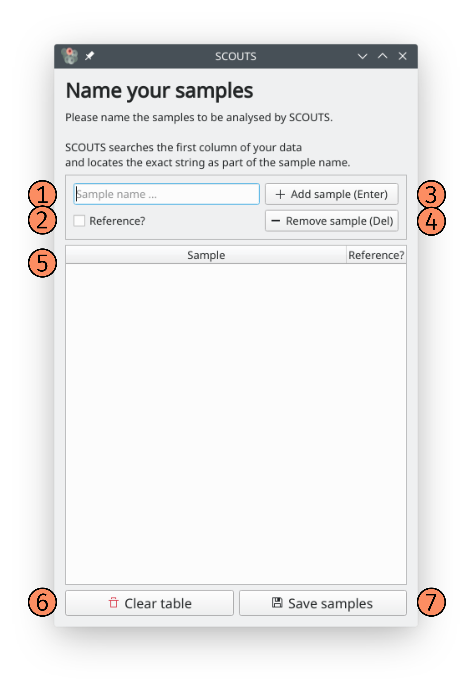
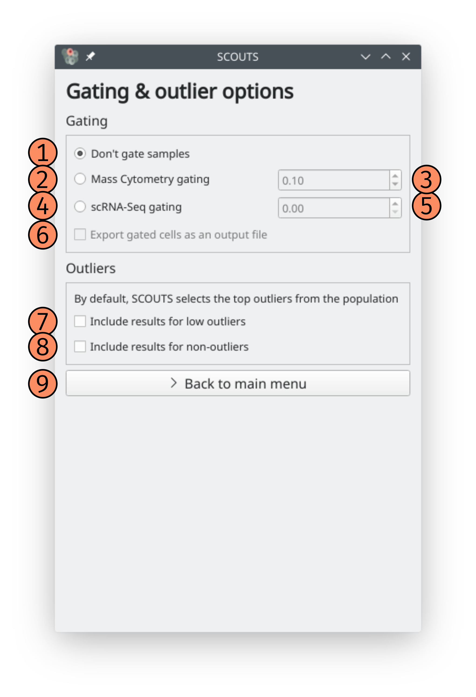

How SCOUTS works
================

Page elements
-------------
This section explains what every button and option of the SCOUTS interface does.

Main window
***********
These are the elements of the main window:

.. image:: _static/gui/scouts_main_page_full_annotations.png
   :scale: 30%
   :alt: SCOUTS main window - annotated
   :align: center

**1) Input file**: this button opens up a dialog to select your input file. Valid input file formats are .xlsx and .csv.

**2) input file text**: this field shows your input file path. It updates after clicking on the input file button and selecting a file. You can also type the path directly here.

**3) Output folder**: this button opens up a dialog to select your output folder. We recommend using an empty folder to avoid confusion.

**4) Output folder text**: this field shows your output folder path. It updates after clicking on the output folder button and selecting a folder. You can also type the path directly here.

**5) Select sample names**: this opens the sample selection window (see below).

**6) Gate samples**: this opens the gate selection window (see below).

**7) Consider outliers using cutoff from**: here you can select which cutoff value SCOUTS uses to consider whether a given sample is an outlier or not.
  - **by sample**: by default, SCOUTS will consider the sample population when calculating cutoff values. This means that each sample population (control, treatment 1, treatment 2, ...) will have a specific cutoff value for each marker.
  - **by control**: using this option, SCOUTS applies the cutoff value from the control sample to all samples. This means that cells of any sample are treated as outliers for a given marker as long as they present a *higher expression than the control* - and not the sample population itself.
  - **both**: this option combines both previously described analyses. Results are saved into different files, with the filename representing the analysis performed.

**8) Consider outliers for**: here you can select how SCOUTS determines if a cell is an outlier or not.
    - **single marker**: by default, SCOUTS will locate outliers for each and every marker. If a given cell is an outlier for 2+ markers, it appears in the output table for each one of these markers. SCOUTS generates one output file for each marker/sample combination.
    - **any marker**: this option considers that cells belong to the outlier population as long as they are above the cutoff value for *at least one marker*. In contrast to the previous analysis, the output generated in this analysis is a single file containing all cells that are outliers for a single marker.
    - **both**: this option combines both previously described analyses. Results are saved into different files, with the filename representing the analysis performed.

**9) Tukey factor**: by default, SCOUTS uses a Tukey factor of 1.5 when calculating the cutoffs for outliers. You can perform a more robust outlier selection by specifying a Tukey factor of 3.0.

**10) Export csv**: this option generates .csv files of the outliers for each marker/sample combination. The output is placed on subfolders organized by sample.

**11) Export Excel**: this option generates .xlsx files of the outliers for each marker/sample combination. The output is placed on subfolders organized by sample.

**12) Generate multisheet Excel**: this option generates one large .xlsx file, in which the outliers for each marker/sample combination are represented by a different sheet. This option is included for user that want to have all analyses on a single file. **Beware: this option consumes a lot of RAM**, and may slow down your PC/crash SCOUTS depending on your setup.

**13) Run**: click here to start SCOUTS. In general, SCOUTS won't let you start if there are empty fields for input, output, samples, etc.

**14) Help**: click here to open this online documentation.

**15) Quit**: click here to exit SCOUTS.

Sample names window
*******************
These are the elements of the sample names window:

**1) Sample name**: type your sample name here.

**2) Control checkbox**: check this box to mark the sample as control (before clicking to add the sample to the list).

**3) Add sample**: click here to add the sample to the list.

**4) Remove sample**: click here to remove a highlighted sample from the list.

**5) Control column**: this column indicates whether this sample should be treated as the control.

**6) Sample name column**: this column displays the name of the sample.

**7) Clear table**: click this button to clear all samples from the table (you will be asked to confirm this action).

**8) Save samples**: click this button to go back to the main page, saving current sample names.

Gating window
*************
These are the elements of the gating window:

**1) No gating**: Do not gate your input. This is the default option.

**2) Gate samples**: Select this option to allow gating (see below).

**3) Gate mass cytometry**: This gating option aims to exclude poorly stained cells from a mass cytometry experiment. Cells that have an average row expression lower than the value on the box **4** will be excluded from the analysis.

**4) Mass cytometry gate value**: Value used by **3** to exclude cells from analysis (default: 0.1).

**5) Gate scRNA-seq**: This gating option excludes cells with 0 expression for a given marker from being part of the subpopulation when calculating the cutoff value for that marker. This means that cutoff values won't be "dragged down" due to many cells having 0 expression.

**6) Generate results for non-outliers**: This option generates extra output files in which the *opposite* population is selected, i.e. the non-outliers.

**7) generate results for low outliers**: This option generates extra output files by selecting outliers from the *bottom* of the population. Note that this subsetting is performed after applying gates to the population, if any.

**8) Save gate options**: click this button to go back to the main page, saving current gate settings.

How SCOUTS selects outliers
---------------------------
SCOUTS starts by selecting all cells that belong to the same sample. From this subset of the original data, SCOUTS calculates the first quartile (Q1) and third quartile (Q3) for each marker -- that is, **SCOUTS treats each marker/sample combination as being a subpopulation**, and calculates Q1 and Q3 for this subpopulation.

The cutoff value for each marker/sample combination is, in turn, calculated using the following formula:

`cutoff = Q3 + (IQR * t)`

where:
  - `Q3` = third quartile;
  - `IQR` = interquartile range (defined as `Q3 - Q1`);
  - `t` = Tukey factor.

The quantiles are, in turn, calculated using a linear interpolation. This specifies how the quantile is calculated when it falls between two data points *a* and *b*. See the `Pandas documentation on quantiles <https://pandas.pydata.org/pandas-docs/stable/generated/pandas.DataFrame.quantile.html>`_ to learn more about this.

Having the cutoff value from each marker/sample combination, SCOUTS proceeds to select cells from the input table with expression values higher than the cutoff. This is either done for each marker individually or for any marker, depending on the settings chosen by the user.

In a similar fashion, the cutoff formula for calculating bottom outliers is:

`cutoff = Q1 - (IQR * t)`

where:
  - `Q1` = first quartile;
  - `IQR` = interquartile range (defined as `Q3 - Q1`);
  - `t` = Tukey factor.

About input and output
----------------------
SCOUTS expects a certain pattern for the input file. Namely, the input should have:
  - a header, containing all markers. This is the first line of a .csv file, or the first row of an Excel spreadsheet;
  - sample names in the first (leftmost) column. This is the field that SCOUTS uses to search for sample names;
  - expression values for all other positions in the input data.

The `Github repository <https://github.com/jfaccioni/scouts/input-template>`_ has an example file showing what the input should ideally look like.

The output from SCOUTS is organized in multiple folders, each folder correspoding to a sample name. The .csv/.xlsx files are within each folder, depending on the settings chosen by the user. SCOUTS has no checks before overwriting files; that being said, the filenames are specific enough so that it is unlikely to overwrite files (other than its own files, generated by a previous run). Still, we recommend creating an empty output folder to organize your results.

Each output file generated by SCOUTS follows this same naming pattern, making it simple to parse and programatically run the results:

**A_B_C_D**.xlsx

where the letters stand for the following:
  - `A` = marker name (e.g. **EGFR**);
  - `B` = sample name (e.g. **Control**);
  - `C` = where the outliers belong to (**top** or **bottom** of the population);
  - `D` = which rule was used to apply the cutoff values (**outliers_by_sample** or **outliers_by_control**, as explained in number **7** of SCOUTS's main page);

Note that a **_pop** is appended to the file name if it represents the subset of the population without the outliers, as per number **6** in SCOUTS's gate page.

About sample names
------------------
SCOUTS also expects sample names to be somewhat organized. Names passed as samples will be searched for in the first column of the input data, and rows containing that name will be used when calculating cutoff values for those samples. Sample names are **case-sensitive**, so be sure to type them correctly.

SCOUTS will throw explicit errors if you do one of the following:
  - try to run the program with an empty sample list;
  - try to run the program with no samples passed as control;
  - a given sample name is not found in the input data.

SCOUTS will **not** stop the analysis nor warn you if the following happens:
  - a given sample name appears in more than one subset of samples.

Good sample names are **crucial** to a good output from SCOUTS.
