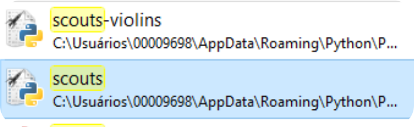

Installation
============
SCOUTS is available as a:

* Python package from PyPI - install with ``pip``
* Conda package - install with ``conda`` (coming soon!)
* GitHub repository - download/clone the repository
* binary release (experimental)

For any installation option (other than the binary release), SCOUTS requires **Python >= 3.6** to installed in your system. To check this, open a terminal/cmd and type:

..code-block:: bash
   :linenos:

   $ python --version

If the output is something like ``Python 3.6``, you're golden!

If the output is something like ``Python 2.7``, try again with:

``$ python3 --version``

If your system can't locate Python3, you may need to `download or upgrade Python <https://www.python.org/>`_.

For PyPI/pip or GitHub installations, we recommend using a `virtual environment <https://docs.python.org/3/tutorial/venv.html>`_, instead of installing SCOUTS into your global/system-wide Python interpreter.

Install from PyPI using ``pip``
-------------------------------
To install SCOUTS, simply type in a terminal:

``$ pip install scouts``

then run SCOUTS by entering ``scouts`` in your terminal.

If you run into problems, check the `troubleshooting section <./install.html#troubleshooting>`_.

Optional: SCOUTS-violins
^^^^^^^^^^^^^^^^^^^^^^^^
If you also want to install SCOUTS-violins, type:

``$ pip install scouts[violins]``

then run SCOUTS-violins by entering ``scouts-violins`` in your terminal.

If you run into problems, check the `troubleshooting section <./install.html#troubleshooting>`_.

Install using ``conda``
-----------------------
Coming soon!

Install from the GitHub repository
----------------------------------
Download this repository into your local machine. Alternatively, clone it with ``git``\ :

``$ git clone https://github.com/jfaccioni/scouts``

Enter the repository's directory:

``$ cd scouts``

Make sure your Python interpreter (version >= 3.6) has the following packages installed:

* `numpy <http://www.numpy.org/>`_
* `pandas <https://pandas.pydata.org/>`_
* `pyside2 <https://wiki.qt.io/Qt_for_Python>`_
* `openpyxl <https://openpyxl.readthedocs.io/en/stable/>`_
* `xlrd <https://xlrd.readthedocs.io/en/latest/>`_

Run SCOUTS by typing:

``$ python scouts.py``

Optional: SCOUTS-violins
^^^^^^^^^^^^^^^^^^^^^^^^
If you also want to install SCOUTS-violins, make sure your Python interpreter (version >= 3.6) has the following additional packages installed:

* `matplotlib <https://matplotlib.org/>`_
* `seaborn <https://seaborn.pydata.org/>`_

Run SCOUTS-violin by typing:

``python scouts-violins.py``

Using ``pipenv`` with the GitHub repository
^^^^^^^^^^^^^^^^^^^^^^^^^^^^^^^^^^^^^^^^^^^
For ``pipenv`` users, we included a ``Pipfile`` for convenience. Simply type ``pipenv install`` from the repository's directory to install SCOUTS into a virtual environment, along with the necessary third-party dependencies. This covers the installation of both SCOUTS and SCOUTS-violins.

Download the binary executable
------------------------------
Download the binary release for your OS:

* `Windows <https://github.com/jfaccioni/scouts/releases/tag/v0.0.1-alpha>`_
* MacOS (coming soon!)
* `Linux <https://github.com/jfaccioni/scouts/releases/tag/v0.1.3-alpha>`_

If you choose this option, please be aware that:

* SCOUTS is a Python package. The executable has a moderately large size (~150 mb), since it has to bundle the whole Python interpreter along with it.
* this is an **experimental release of SCOUTS**\ , and as such it is not expected to support all OS configurations. If you run into any problems, please choose another installation method.

Troubleshooting
---------------
These are some common errors you may run into when trying to install SCOUTS:

``pip is not recognized as an internal or external command, operable program or batch file``

If you have Python >= 3.6 installed but see the message above, you need to add `Python to your Windows PATH <https://datatofish.com/add-python-to-windows-path/>`_.

``ERROR: Could not install packages due to an EnvironmentError``

This error happens if you have installed Python to your system (with admin privileges) but run the terminal/cmd as a user (without admin privileges). You have a couple of options to circumvent this:

1) Use a `virtual environment <https://docs.python.org/3/tutorial/venv.html>`_. This creates an isolated Python interpreter to your user and avoids the ``pip`` packages from interfering with your system's Python.
2) Run the terminal/cmd as admin:
  - On Windows, search for ``cmd`` on the search bar, right-click and select "run as administrator"
  - On Mac/Linux, use the command ``sudo pip install scouts``
3) Install ``scouts`` to your user. Add the ``--user`` flag to pip (e.g.``pip install --user scouts``). Note that SCOUTS may be downloaded to a folder not in PATH, so your system won't be able to automatically locate it (see below).
4) Reinstall Python inside your User folder.

``SyntaxError: invalid syntax``

You are probably trying to run ``pip`` from within the Python interpreter. Exit the Python interpreter with ``exit()`` and use ``pip`` from your system shell/command line.

``scouts is not recognized as an internal or external command, operable program or batch file``

Make sure that ``pip install scouts`` has successfully installed ``scouts``.

If you still see this message, the folder containing ``scouts`` is probably not in your PATH (likely due to conflicts between where you installed Python and where ``pip`` installed ``scouts``). You can either:

1) Manually run SCOUTS by searching for ``scouts`` on the Windows Explorer search bar, and running the application (as per the image below):

2) Add the folder containing the files found in step 1 to Windows PATH
