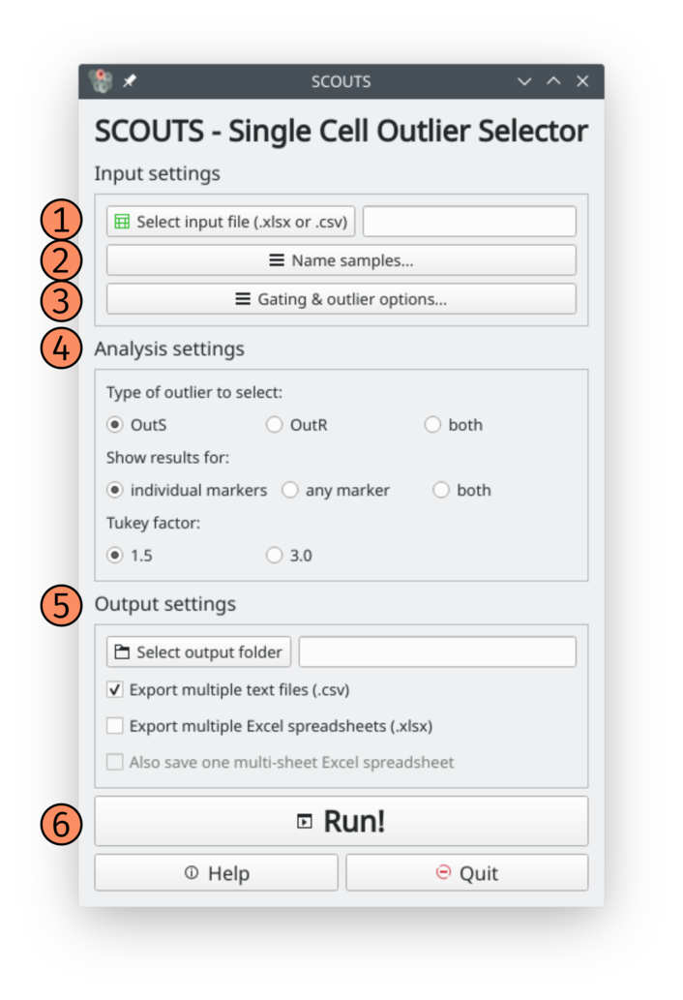
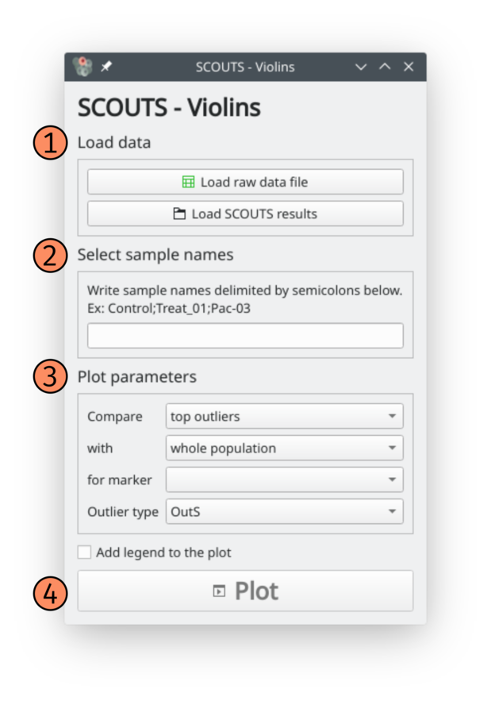

Basic usage
===========
The ``scouts`` package include two user interfaces:

* **SCOUTS**\ : used to select outliers in a population of single-cells.
* **SCOUTS-violins** (optional): used to visually inspect outliers selected by SCOUTS.

Using SCOUTS
------------
This is a basic rundown of the interface when you start SCOUTS: 

1) Choose your input data
2) Choose your sample names - `explanation here <https://scouts.readthedocs.io/en/master/work.html>`_
3) Choose whether to gate samples and analyse other outlier populations - `explanation here <https://scouts.readthedocs.io/en/master/work.html>`_
4) Choose how to perform outlier selection - `explanation here <https://scouts.readthedocs.io/en/master/work.html>`_
5) Choose how and where to save output
6) Run the program

Using SCOUTS-violins
--------------------
This is a basic rundown of the interface when you start SCOUTS-violins: 

1) Choose your input data (same input file used for SCOUTS + SCOUTS output folder)
2) Choose your sample names - `explanation here <https://scouts.readthedocs.io/en/master/work.html>`_
3) Choose plot parameters
4) Plot your data
