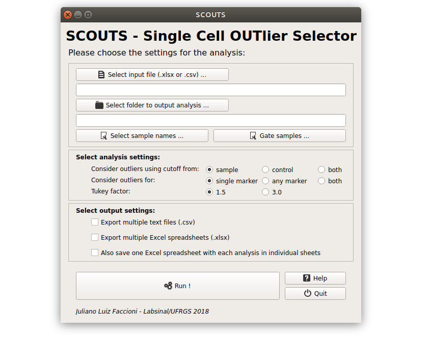
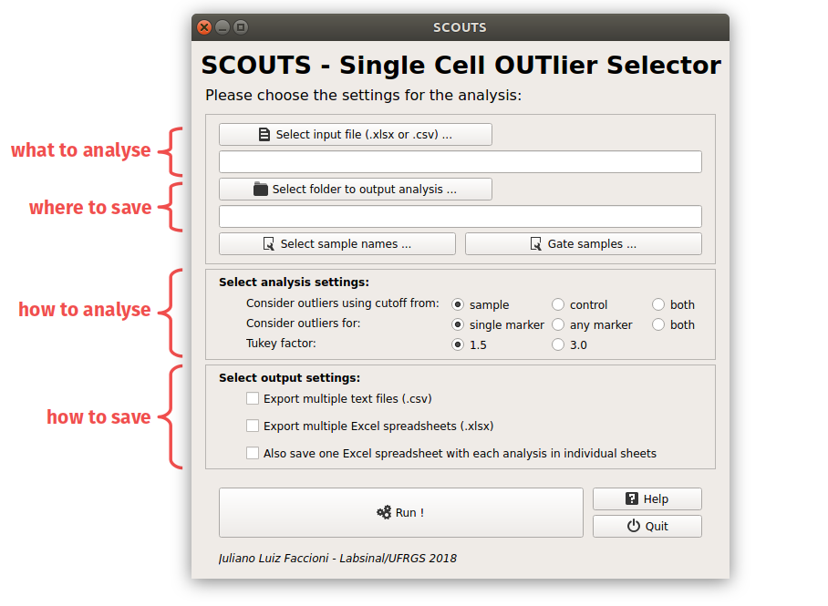
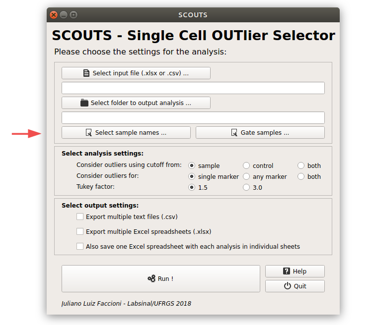
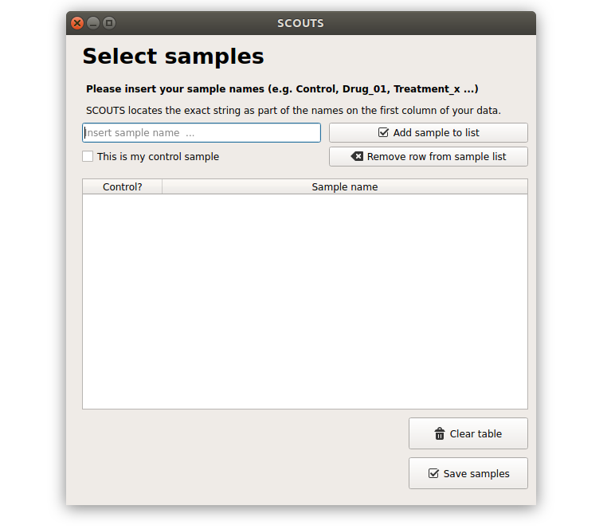
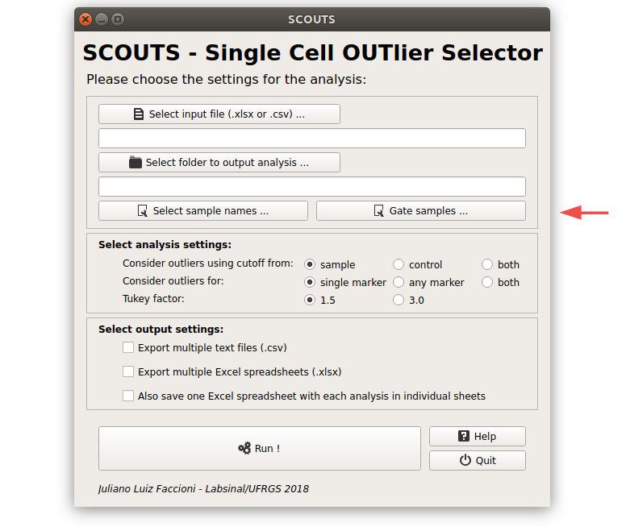
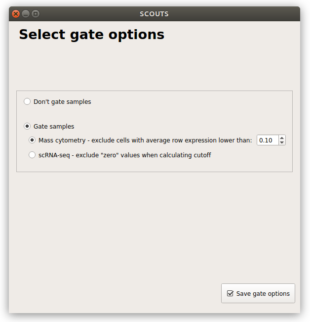
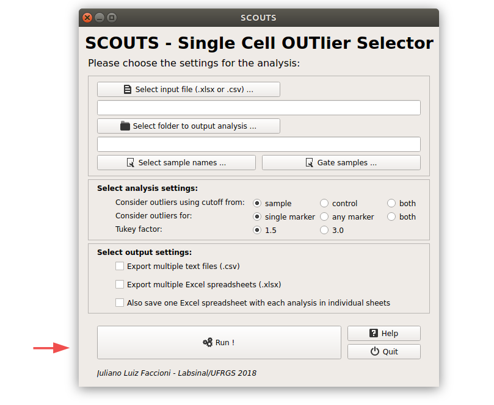

Quickstart
==========
When you start SCOUTS, you should see this:

These are your main options for the analysis:

Sample names are particularly important (if the application does not find a given sample, it warns you and stops the analysis). Click here to select and edit them:

In this window you can inform SCOUTS what your samples are named. You don't have to use the full sample name - any identifier exclusive to each sample is enough, as long as it is part of your samples in your input. Don't forget to add a control sample, too.

`How SCOUTS works <./work.html>`_ has a detailed explanation of how the program reads and parses sample names.

You can also gate your samples, if you want:

The gating functionality works differently for Cytof and RNAseq samples. Refer to `How SCOUTS works <./work.html>`_ for details.

Ready? Click **Run**!

