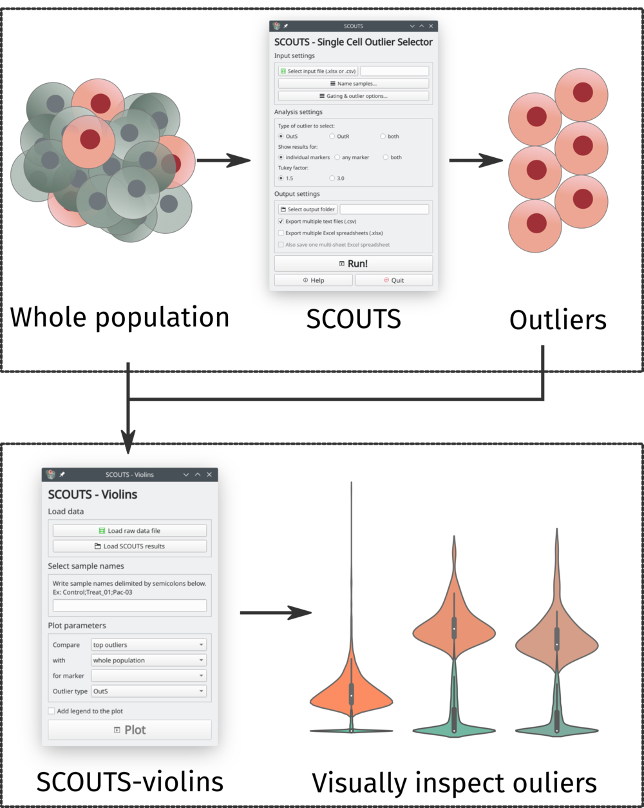

Why SCOUTS?
===========
Many single-cell analytical pipelines require some level of programming knowledge in order to be used. While some great tools for languages like R, Python and Julia have been developed, the entry-level barrier of programming is still intimidating for many scientists starting on the field of singe-cell analysis. With this in mind, we developed SCOUTS to simplify this process. Through a desktop application, the user is able to choose the parameters for the outlier selection, and leave the hard work of programmatically subsetting the data to SCOUTS.

As a showcase of how to interpret and explore the data generated by SCOUTS, we also developed **SCOUTS-violins**, a secondary desktop application which displays the outlier populations identified by SCOUTS as violin plots.

